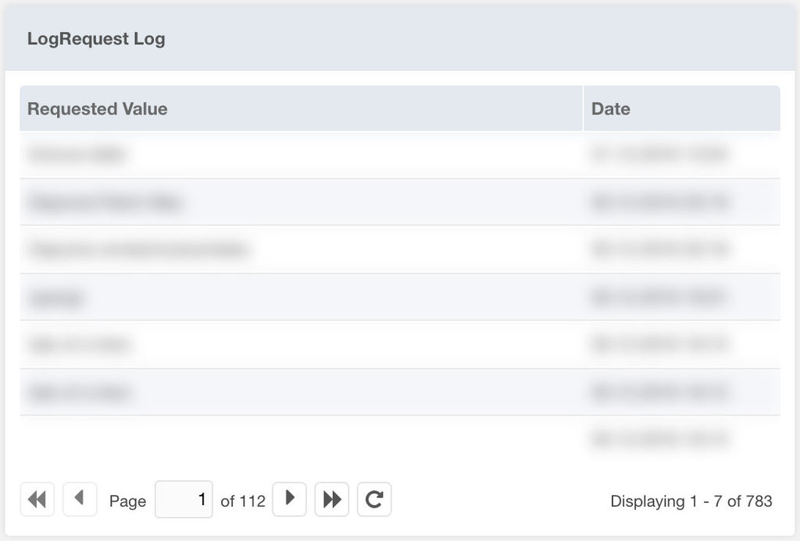
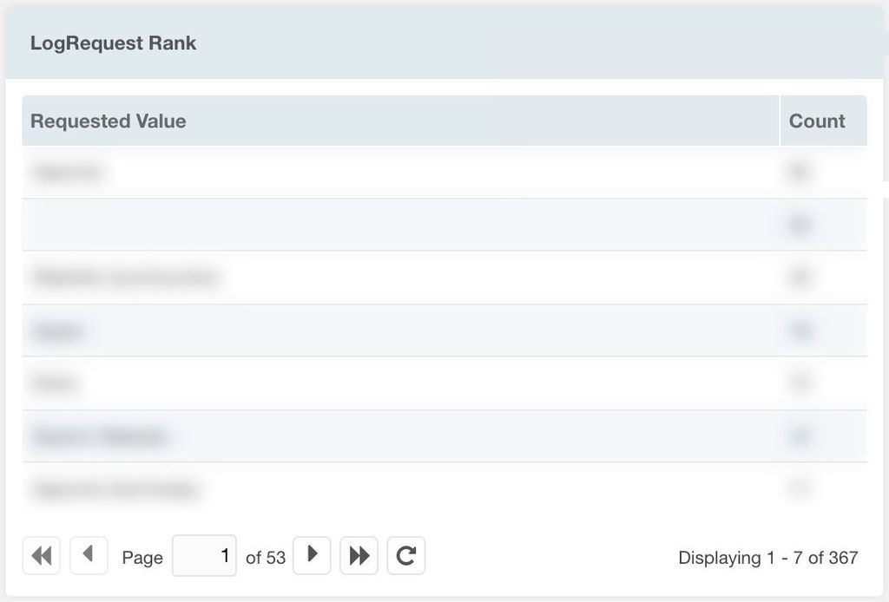

After the package is installed, populate the MODX system setting
`logrequest.trigger` with a request parameter key (or comma separated list of
keys) to be logged. Install the widget(s) in the dashboard to display the logged
key values.

## Widgets

LogRequest contains two dashboard widgets to display the logged data:

### LogRequest Log

This widget displays the logged requests by date/time

### LogRequest Rank

This widget displays the logged requests by rank

## System Settings

LogRequest uses the following system settings in the namespace `logrequest`:

| Key             | Description                                    | Default |
|-----------------|------------------------------------------------|---------|
| Request Trigger | Request key that triggers the request logging. | -       |
